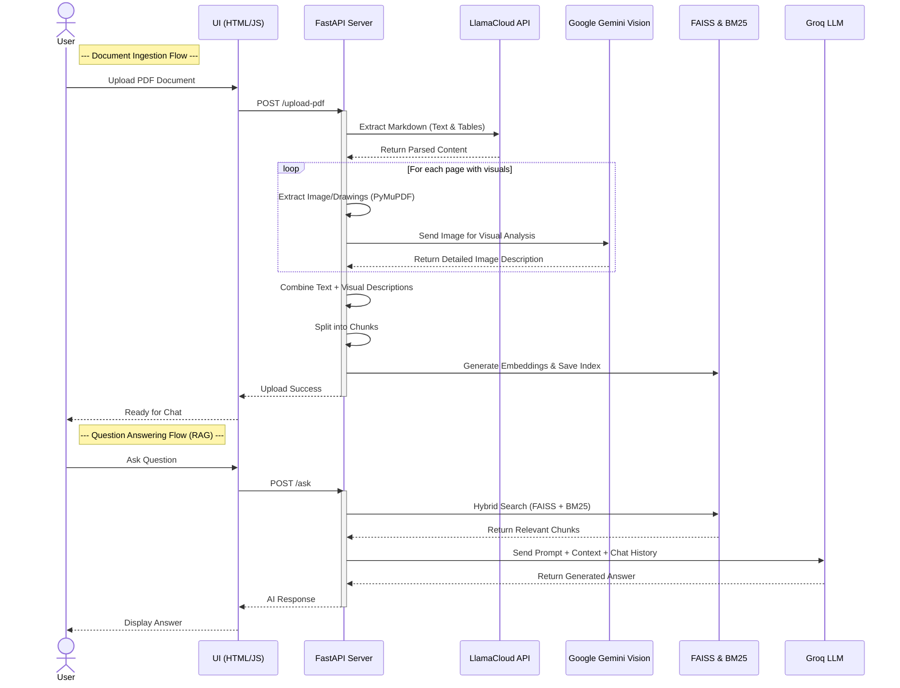

# 🤖 InsightLense - Multimodal RAG Document Assistant

InsightLense is a next-generation Retrieval-Augmented Generation (RAG) chatbot capable of understanding **Text, Tables, and Charts** within PDF documents. 

Unlike standard chatbots that only read text, InsightLense uses **Computer Vision** to "see" and interpret graphs, diagrams, and figures, ensuring no vital data is left behind.

---

## 🚀 Key Features

- **Multimodal Ingestion:** Extracts and understands complex charts and figures using Google Gemini Vision.
- **Smart Table Parsing:** Preserves table structures using LlamaParse (Markdown mode) for accurate data retrieval.
- **Hybrid Search:** Combines Semantic Search (FAISS) with Keyword Search (BM25) to find both conceptual answers and specific metrics.
- **Fail-Safe Architecture:** Includes rate-limiting and error handling to gracefully manage API quotas.

---

## 🛠️ Tech Stack

- **LLM:** Llama-3 / GPT-OSS (via Groq) for high-speed reasoning & answering.
- **Vision Model:** Gemini 2.5 Flash (via `google-genai` SDK) to parse images and diagrams.
- **Vector DB:** FAISS + BM25 (Ensemble Retriever) for robust search.
- **Parsing:** LlamaParse (Text/Tables) + PyMuPDF (Images).
- **Backend:** FastAPI for serving the API and UI.
- **Orchestration:** LangChain (Core & Classic).

---

## ⚙️ Installation & Usage

### 1. Clone the Repository
```bash
git clone https://github.com/jayesh-cmd/InsightLense-Research_Document.git
cd InsightLense-Research_Document
```

### 2. Install Dependencies
```bash
pip install -r requirements.txt
```

### 3. Set Environment Variables
Create a `.env` file in the root directory and add your API keys:
```env
GEMINI_API_KEY=your_gemini_key
GROQ_API_KEY=your_groq_key
LLAMA_CLOUD_API_KEY=your_llama_parse_key
```

### 4. Run the Server
Start the FastAPI server.
```bash
uvicorn main:app --reload
```

### 5. Use the App
- Open your browser and navigate to `http://127.0.0.1:8000`.
- **Step 1:** Upload a PDF document.
- **Step 2:** Start asking questions (e.g., *"What does Figure 8 show about LNG supply?"*).

---

## 📊 High Level Design (HLD)

The following sequence diagram illustrates the core workflows of InsightLense: **Document Ingestion** and **Question Answering (RAG)**.


